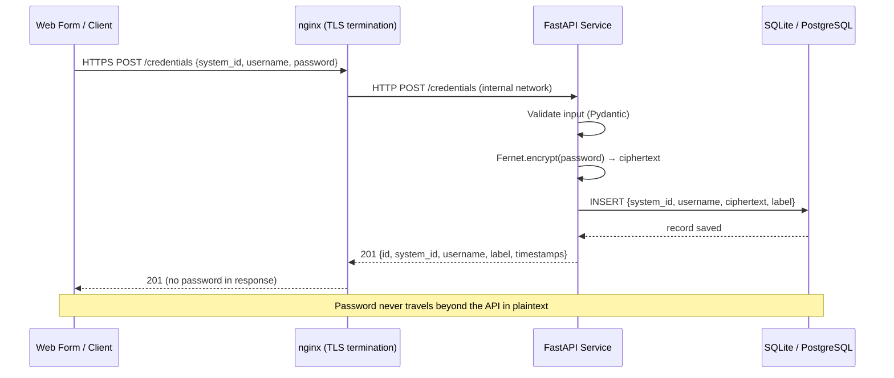
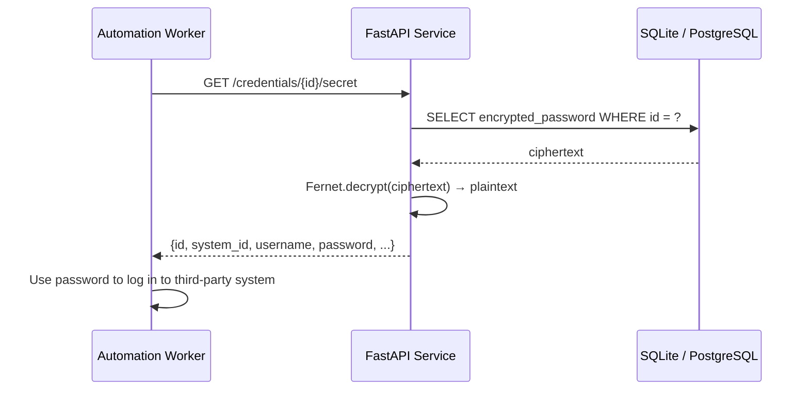

# Architecture & Design

## System Overview





## Storage Model

```
credentials table
─────────────────────────────────────────────────────────
 id                  UUID (PK)
 system_identifier   VARCHAR(128)   e.g. "salesforce-prod"
 username            VARCHAR(256)   e.g. "alice@example.com"
 encrypted_password  TEXT           Fernet token (AES-128 ciphertext)
 label               VARCHAR(256)   optional description
 created_at          TIMESTAMPTZ
 updated_at          TIMESTAMPTZ
─────────────────────────────────────────────────────────
```

The `encrypted_password` column holds a Fernet token which is a base64url-encoded
string containing: version byte | timestamp | IV | ciphertext | HMAC.

## Encryption Key Lifecycle

```
Production (recommended)
────────────────────────
Secrets Manager (Vault / AWS SM)
        │
        ▼
   App on startup  ──reads──►  ENCRYPTION_KEY env var
        │
        ▼
   Fernet(key)  ──used for──►  encrypt() / decrypt()
        │
        ▼
   Key never written to disk or DB
```

## Endpoint Map

| Method   | Path                              | Returns password? |
|----------|-----------------------------------|-------------------|
| POST     | /credentials                      | No — metadata only |
| GET      | /credentials                      | No — metadata only |
| GET      | /credentials/{id}                 | No — metadata only |
| GET      | /credentials/{id}/secret          | Yes — decrypted    |
| PATCH    | /credentials/{id}                 | No — metadata only |
| DELETE   | /credentials/{id}                 | —                  |

The `/secret` endpoint should only be reachable from internal services in production.
