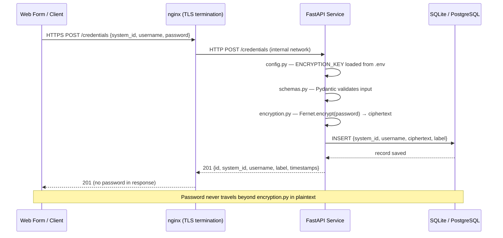
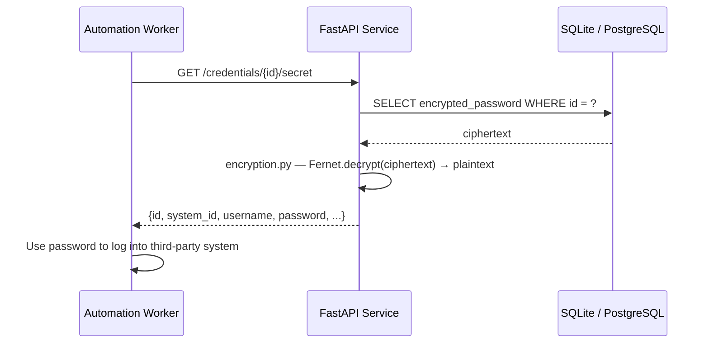
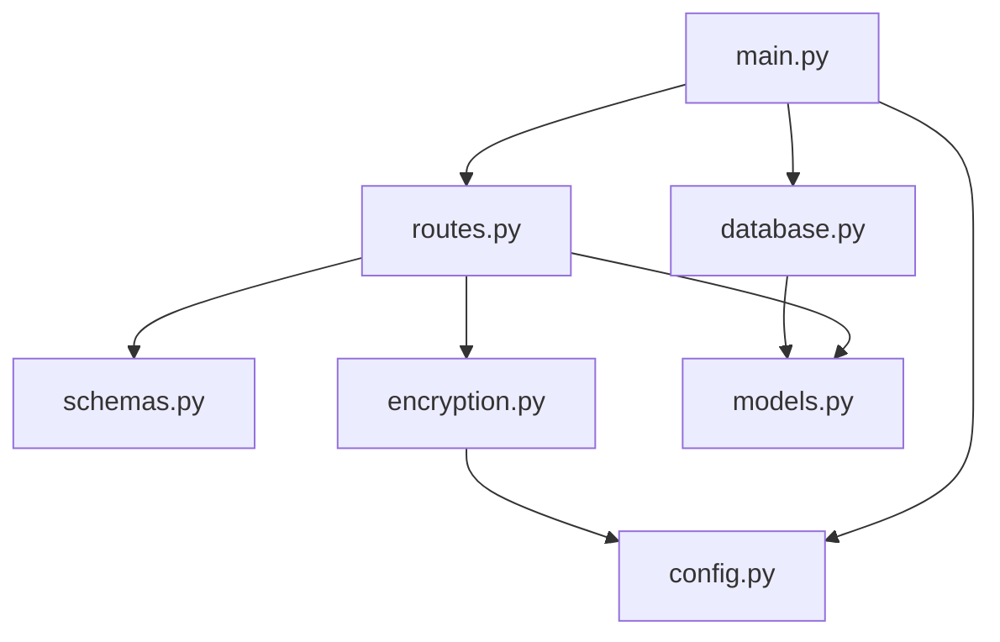

# Architecture & Design

## System Overview



---

## Secret retrieval (automation worker)



---

## Module responsibilities



| Module | Responsibility |
|---|---|
| `main.py` | Creates the FastAPI app, registers middleware and routes, triggers table creation |
| `config.py` | Loads `.env` via `python-dotenv`, validates `ENCRYPTION_KEY`, exposes config |
| `database.py` | SQLAlchemy engine, session factory, `get_db()` dependency |
| `models.py` | ORM model — defines the `credentials` table |
| `schemas.py` | Pydantic input and response models — validation and serialisation |
| `encryption.py` | `encrypt_password()` and `decrypt_password()` — all Fernet logic lives here |
| `routes.py` | All API endpoints — calls encryption and database, returns safe responses |

---

## Storage model

```
credentials table
─────────────────────────────────────────────────────────
 id                  UUID (PK)
 system_identifier   VARCHAR(128)   UNIQUE — one per system
 username            VARCHAR(256)
 encrypted_password  TEXT           Fernet token (AES-128 ciphertext)
 label               VARCHAR(256)   nullable
 created_at          TIMESTAMPTZ
 updated_at          TIMESTAMPTZ
─────────────────────────────────────────────────────────
```

`system_identifier` has a UNIQUE constraint at the database level. Only one
credential per third-party system is allowed. A second POST with the same
`system_identifier` returns 409 — use PATCH to update.

The `encrypted_password` column contains a Fernet token: a base64url string
that embeds the version, timestamp, IV, ciphertext, and HMAC. The plaintext
never appears in any column.

---

## Encryption key lifecycle

```
Development
───────────
.env file
    │
    ▼
config.py — load_dotenv() reads .env
    │
    ▼
ENCRYPTION_KEY env var
    │
    ▼
Fernet(key) in memory — used for encrypt() / decrypt()


Production (recommended)
────────────────────────
Secrets Manager (Vault / AWS Secrets Manager / GCP Secret Manager)
    │
    ▼
config.py — reads ENCRYPTION_KEY from environment
    │
    ▼
Fernet(key) in memory — key never written to disk
```

---

## Endpoint map

| Method | Path | Password in response? | Notes |
|---|---|---|---|
| POST | /credentials | No | Encrypts and stores |
| GET | /credentials | No | Metadata only, optional filter |
| GET | /credentials/{id} | No | Metadata only |
| GET | /credentials/{id}/secret | **Yes** | Internal only — protect in production |
| PATCH | /credentials/{id} | No | Re-encrypts if password changes |
| DELETE | /credentials/{id} | — | Permanent removal |
| GET | /health | — | Liveness probe |

---

## Error handling strategy

| Code | Meaning | Where raised |
|---|---|---|
| 400 | Empty PATCH body | routes.py |
| 404 | Credential not found | routes.py — _get_or_404() |
| 409 | system_identifier already exists | routes.py — create_credential() |
| 422 | Validation failure | Pydantic / FastAPI automatic |
| 500 | DB failure or encryption/decryption error | routes.py, encryption.py |

All 500 errors log the full detail server-side but return a generic message
to the client — no internal information is leaked.
